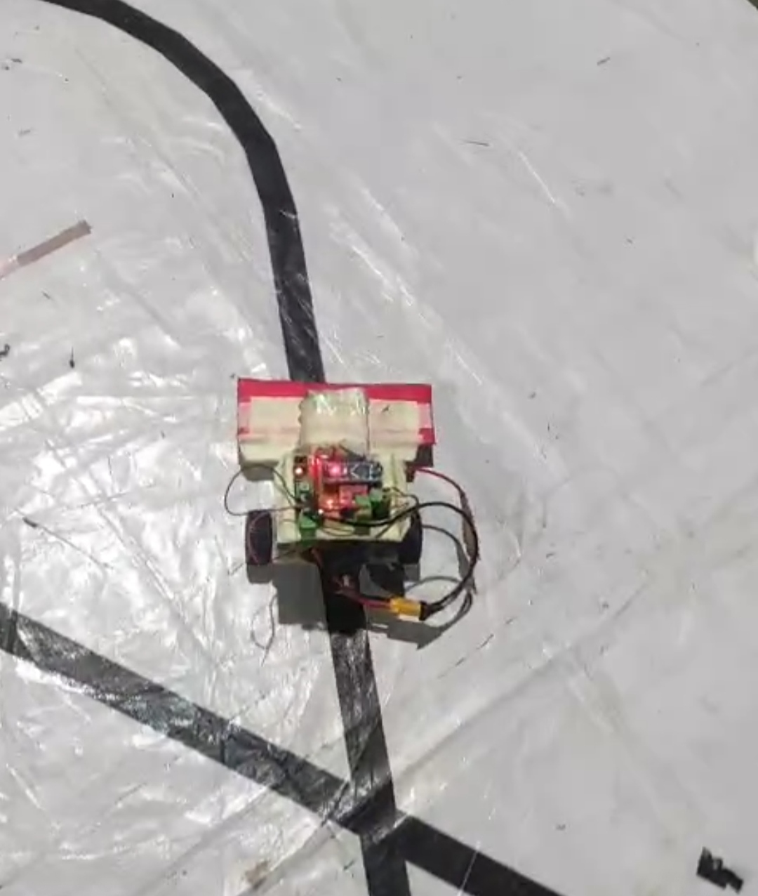
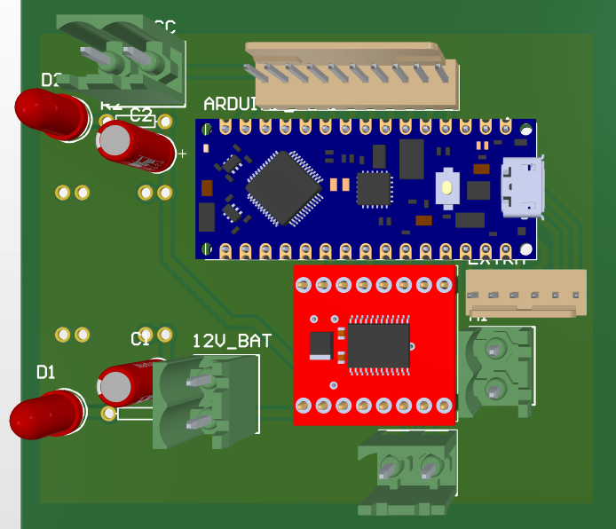
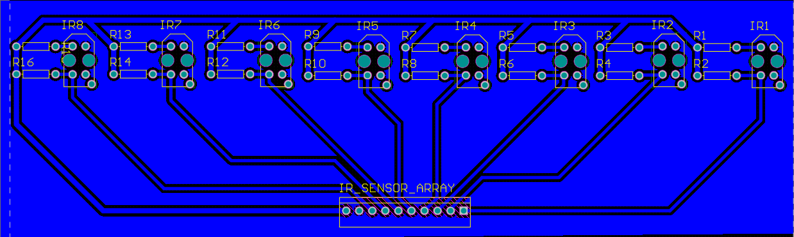

# PID Line Follower Robot

## Overview

This project is a custom-built PID based Line Follower Robot designed during my 1st semester of Electronics & Telecommunication Engineering (ENTC).

The robot uses an array of IR sensors to detect the line and a PID control algorithm to achieve smooth and stable line following.

---

# Final Robot

<p align="center">
  
</p>

---

# Hardware Used

| Component | Description |
|---|---|
| Microcontroller | Arduino Nano |
| Motor Driver | TB6612FNG |
| Sensors | 8x TCRT5000 |
| Motors | N20 Gear Motors |
| Power Supply | LiPo Battery |
| Buck Converter | MP1584 |
| PCB Software | Altium Designer |

---

# Main PCB

<p align="center">
  
</p>

### Features
- Arduino Nano interface
- TB6612FNG motor driver section
- Power distribution
- Battery connector
- Sensor array connector

---

# IR Sensor Array PCB

<p align="center">
  
</p>

### Sensor Array
- 8 × TCRT5000 sensors
- Analog line detection
- Compact custom PCB

---

# Working Principle

The robot continuously reads data from the IR sensor array and calculates the position of the line.

A PID controller is used to minimize the error and adjust motor speeds dynamically for smooth and stable line following.

---

# PCB Design & Manufacturing

Both PCBs were designed in Altium Designer and manufactured in-house using copper clad boards.

The process included:
- PCB schematic design
- PCB routing
- Etching
- Drilling
- Soldering
- Testing

---

# Learning Outcomes

Through this project, I learned:
- PID control fundamentals
- Embedded programming
- PCB design in Altium
- Sensor interfacing
- Motor control
- Hardware debugging
- In-house PCB manufacturing

---


# Project Structure

```bash
├── IRArray_PCB/
├── LineFollower_Code/
├── Main_PCB/
├── Media/
└── README.md
```
